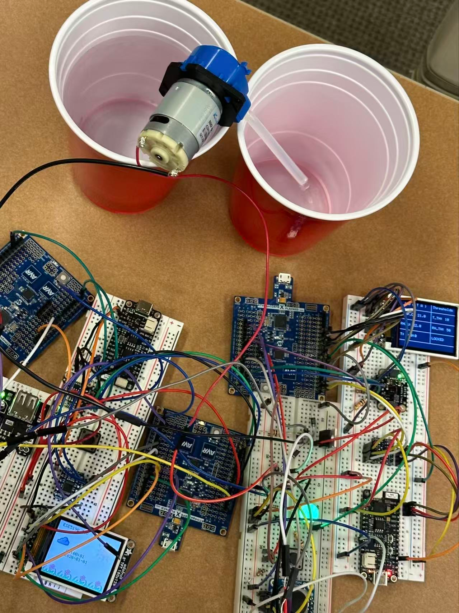
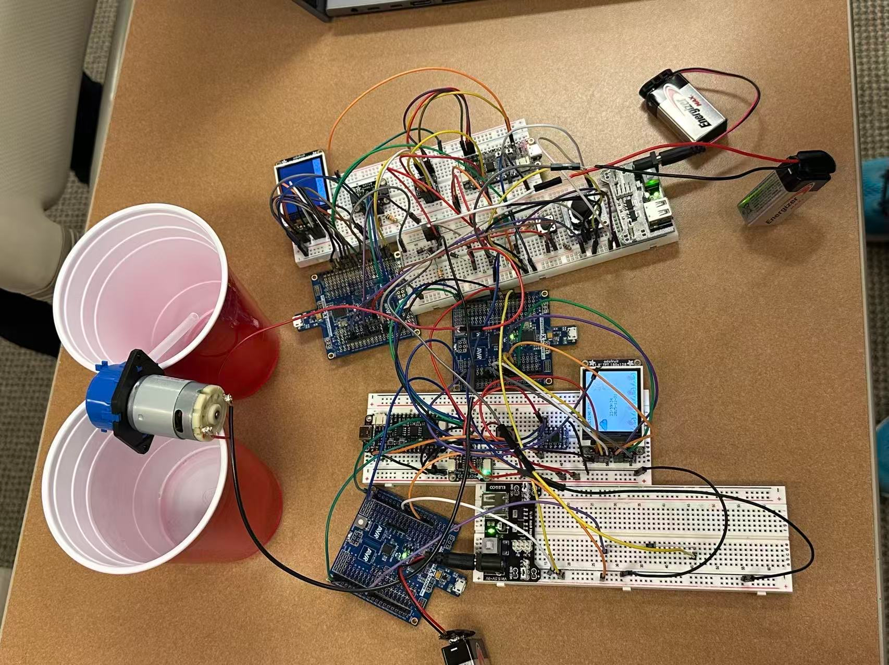
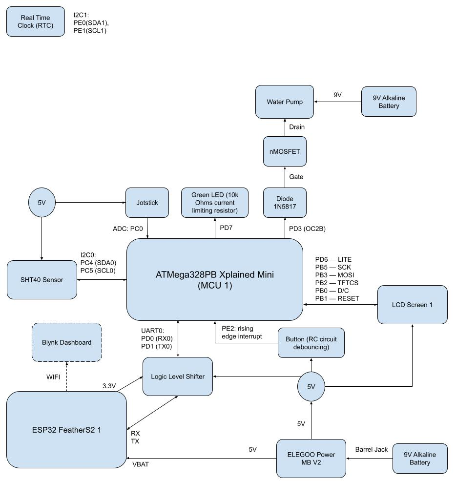

# final-project-website-submission-f25-t30-f25-int-main-void

## Final Project Report

**Team Number: 30**

**Team Name: int main(void)**

| Team Member Name | Email Address          |
| ---------------- | ---------------------- |
| Zexin Feng       | zexinf@seas.upenn.edu  |
| Peiyu Chen       | peiyuch@seas.upenn.edu |
| Yuxin Jing       | jingyxg@seas.upenn.edu |

**GitHub Repository URL: https://github.com/upenn-embedded/final-project-f25-f25-final_project-t30.git**

**GitHub Public Repository URL (final-project-website-submission): https://github.com/upenn-embedded/final-project-website-submission-f25-t30-f25-int-main-void.git**

**GitHub Pages Website URL:  https://zexinf666.github.io/final-project-website-submission-f25-t30-f25-int-main-void/**

Don't forget to make the GitHub pages public website!
If you’ve never made a GitHub pages website before, you can follow this webpage (though, substitute your final project repository for the GitHub username one in the quickstart guide):  [https://docs.github.com/en/pages/quickstart](https://docs.github.com/en/pages/quickstart)

### 1. Video

[Insert final project video here]

* The video must demonstrate your key functionality.
* The video must be 5 minutes or less.
* Ensure your video link is accessible to the teaching team. Unlisted YouTube videos or Google Drive uploads with SEAS account access work well.
* Points will be removed if the audio quality is poor - say, if you filmed your video in a noisy electrical engineering lab.

### [Video Link](https://drive.google.com/file/d/15BnlUx_5UzXOKajAlkQ2Qy3TK4Bdy0N3/view?usp=sharing)

### 2. Images

[Insert final project images here]

*Include photos of your device from a few angles. If you have a casework, show both the exterior and interior (where the good EE bits are!).*

### 3. Results

*What were your results? Namely, what was the final solution/design to your problem?*

**Final block diagram:**

MCU2 control the RTC to trigger the water pump.

MCU2 control the screen.

We built a drip irrigation device that irrigates plants.
If the soil is already dry, especially for arid regions, it will be too late for the device to irrigate the plant. To prevent this, the device irrigates the plant in 2 ways: 1. Regular irrigation routine: Irrigate the plant at specific moments controlled by RTC. 2. Frequent irrigation routine: Check if the temperature threshold and the relative humidity threshold are both exceeded. If yes, irrigate the plant every 30 minutes (we used 5 minutes for final demostration) that the flow rate is controlled by the water pump PWM duty cycle = 5 * (temperature - temperature threshold) + 10 * (relative humidity - relative humidity threshold).

Users may press the button to unlock the device if they want to change the 2 thresholds. When the LCD screen 1 shows "LOCKED", the user cannot change any thresholds. If the button is pressed once, the LCD screen 1 shows "T UNLOCKED", then the user may modify the temperature threshold using a joystick. If the button is pressed one more time, the LCD screen 1 shows "RH UNLOCKED", then the user may modify the relatively humidity threshold using a joystick.

Users may employ the RTC to schedule watering for plants. We have implemented a feature allowing users to set specific times, at which point a PWM signal will automatically trigger to perform a ten-second watering cycle for the plants.

Besides, the device is able to show real time, measured data, device operating time and thresholds locally on a LCD screen, and show measured data and thresholds remotely on the Blynk dashboard.

#### 3.1 Software Requirements Specification (SRS) Results

*Based on your quantified system performance, comment on how you achieved or fell short of your expected requirements.*

*Did your requirements change? If so, why? Failing to meet a requirement is acceptable; understanding the reason why is critical!*

*Validate at least two requirements, showing how you tested and your proof of work (videos, images, logic analyzer/oscilloscope captures, etc.).*

| ID     | Description                                                                                                                                                                                                                       | Validation Outcome                                                                                                                                                                                                            |
| ------ | --------------------------------------------------------------------------------------------------------------------------------------------------------------------------------------------------------------------------------- | ----------------------------------------------------------------------------------------------------------------------------------------------------------------------------------------------------------------------------- |
| SRS-01 | Watering accuracy in timed mode is within 1 second. Reference video.                                                                                                                                                              |                                                                                                                                                                                                                               |
| SRS-02 | Detect relative humidity every second. Every detection should be done within 1 second. Each detection should contain 10 measurements. If both temperature and relative humidity exceed thresholds, the water pump delivers water. | Confirmed, see the final demostraction video and the screenshot[10 Measurements](https://github.com/upenn-embedded/final-project-website-submission-f25-t30-f25-int-main-void/blob/main/images/sprint2_i2c0_overall.png) in the GitHub repository.  |
| SRS-03 | Detect temperature every second. Every detection should be done within 1 second. Each detection should contain 10 measurements. If both temperature and relative humidity exceed thresholds, the water pump delivers water.       | Confirmed, see the final demostraction video and the screenshots[10 Measurements](https://github.com/upenn-embedded/final-project-website-submission-f25-t30-f25-int-main-void/blob/main/images/sprint2_i2c0_overall.png) in the GitHub repository. |
| SRS-05 | The user should be able to tune temperature threshold form -20 to 80 Celsius and tune relative humidity threshold form 0 to 100 RH%                                                                                               | Confirmed, see the[mcu1_main.c](https://github.com/upenn-embedded/final-project-website-submission-f25-t30-f25-int-main-void/blob/main/code/mcu1/mcu1_main.c)                                                                                            |

SRS-02 and SRS-03 are changed because: 1. Detecting temperature and relative humidity every one hour makes no sense. The device should continuously measure temperature and relative humidity to show the up to date data to the user. 2. To enable the user to change thresholds without delaying other tasks, the device must run applications in polling style. 3. More specific description of the water pump operation condition should be shown.

SRS-05 is added because this is a new function added in **Sprint2**.

#### 3.2 Hardware Requirements Specification (HRS) Results

*Based on your quantified system performance, comment on how you achieved or fell short of your expected requirements.*

*Did your requirements change? If so, why? Failing to meet a requirement is acceptable; understanding the reason why is critical!*

*Validate at least two requirements, showing how you tested and your proof of work (videos, images, logic analyzer/oscilloscope captures, etc.).*

| ID     | Description                                                                                                                                                                                                    | Validation Outcome                                                                                                                                                                                                                                                                                                             |
| ------ | -------------------------------------------------------------------------------------------------------------------------------------------------------------------------------------------------------------- | ------------------------------------------------------------------------------------------------------------------------------------------------------------------------------------------------------------------------------------------------------------------------------------------------------------------------------ |
| HRS-01 | The maximum operating power of the HRS-01 pump is 2.04W.                                                                                                                                                       |                                                                                                                                                                                                                                                                                                                                |
| HRS-02 | A relative humidity and temperature sensor shall be used for detection of relative humidity at least ranging from 30% to 80%, and temperature at least ranging from -10 Celsius degrees to 50 Celsius degrees. | Confirmed, see the[SHT40 Datasheet](https://sensirion.com/media/documents/33FD6951/6555C40E/Sensirion_Datasheet_SHT4x.pdf), as well as the [test in a high-humid environment](https://github.com/upenn-embedded/final-project-website-submission-f25-t30-f25-int-main-void/blob/main/images/HRS03_humidity.jpg).                                        |
| HRS-03 | A relative humidity and temperature sensor shall have the accuracy tolerance of 4% RH and 1 Celsius degree.                                                                                                    | Temperature accuracy tolerance is confirmed, see picture[HRS03 temperature](https://github.com/upenn-embedded/final-project-website-submission-f25-t30-f25-int-main-void/blob/main/images/HRS03_temperature.jpg) in the repository as well as [SHT40 Datasheet](https://sensirion.com/media/documents/33FD6951/6555C40E/Sensirion_Datasheet_SHT4x.pdf). |
| HRS-04 | RTC controls watering duration for 10 seconds.                                                                                                                                                                 |                                                                                                                                                                                                                                                                                                                                |

### 4. Conclusion

Reflect on your project. Some questions to address:

* What did you learn from it?
  1. Integrate different eletronics components together to realize desired functions.
  2. Write an I2C driver. Increase I2C speed by settings in firmware and decreasing pull-up resistors in hardware.
  3. Using UART, build communication between 2 MCUs.
  4. Use the logic analyzer to help writing I2C driver.
  5. Choose proper components that meet the goal. Make "Plan B" for the condition that key components we ordered (SHT30 and water pump) were NOT arrived as we planned.
  6. Trigger the generator using a PWM signal.
* What went well?
  1. Measure temperature and relative humidity, and show them and their thresholds on a LCD screen and on the Blynk dashboard through WIFI.
  2. Operate water pump when both the temperature and relative humidity exceed their thresholds. The water pump works at a speed decided by the difference between the temperature and its threshold plus the difference between the relative humidity and its threshold.
  3. User is able to adjust thresholds of temperature and relative humidity.
  4. Also show device operating time on the LCD screen.
* What accomplishments are you proud of?
  1. Realize all applications by bare metal programming, except the code for ESP32 FeatherS2 to receive message from ATmega328PB and to send message to the Blynk dashboard.
  2. Integrate what we have learned in Worksheets and Labs, such as PWM, interrupt, ADC, UART, I2C, button debouncing, .
  3. Write I2C driver for SHT40 sensor. Increase the actual I2C speed by decreasing the pull-up resistance.
  4. "Plan B" for unexpected conditions works well.
* What did you learn/gain from this experience?
  1. The process of building a project in real life.
  2. Time management. Make backup plan.
  3. Logic analyzer is extremely helpful in testing and debugging I2C, UART and PWM.
* Did you have to change your approach?
  1. Change SHT30 sensor to SHT40 sensor because it is said to be arrived but I cannot find it.
  2. Change the water pump we ordered to a water pump in Detkin Lab since the water pump we ordered did NOT arrive.
  3. Add function that enable user to modify thresholds to increase the device's practicallity and flexibility.
* What could have been done differently?
  1. Integrate all applications in one ATmega328PB Xplained Mini board.
  2. Build a shell by 3D printing.
* Did you encounter obstacles that you didn’t anticipate?
  1. Construct the project proposal.
  2. 2 out of 3 components we ordered were NOT avaliable: SHT30 sensor and the water pump.
  3. Time management and collabration.
* What could be a next step for this project?
  1. Integrate RTC application with the system in firmware level. Build a shell by 3D printing.

## References

Fill in your references here as you work on your final project. Describe any libraries used here.

1. [ESP32 UART API](https://docs.espressif.com/projects/arduino-esp32/en/latest/api/serial.html)
2. [Send Data to Blynk](https://docs.blynk.io/en/getting-started/how-to-display-any-sensor-data-in-blynk-app)
